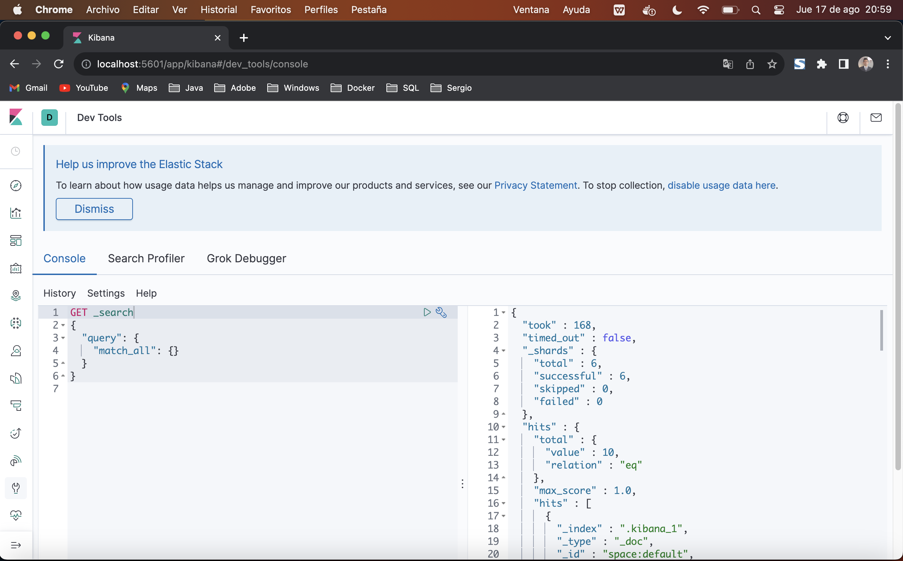
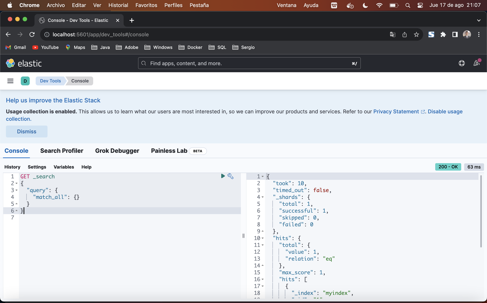
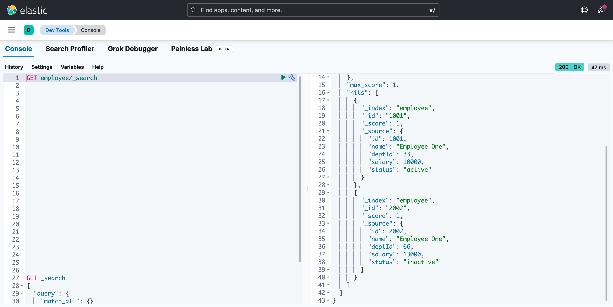
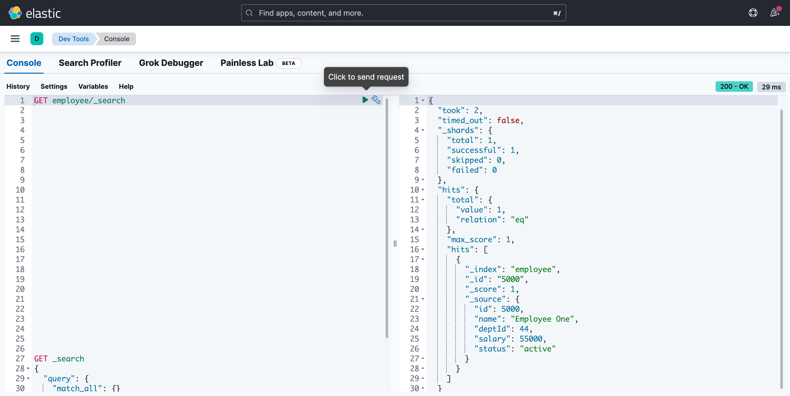

# PLAIN JAVA EXAMPLE USING ELASTICSEARCH JAVA CLIENT

## Synopsis

The project is a simple plain java application that shows how to index information to Elasticsearch using both, old RestHighLevelClient and new ElasticsearchClient. 

## Motivation

I wanted to have a comparison about using old RestHighLevelClient and new ElasticsearchClient.

## Pre Requirements

- You need Elasticsearch running.
- You need Kibana running.

I added a docker-compose.yml file which has both, the old Elasticsearch and Kibana versions 7.6.1
Just uncomment the image for old and comment the new.

And also the new Elasticsearch and Kibana versions 8.9.1 (August 2023)


Running OldElasticsearchJavaClient:
-----------------------------------
In docker-compose.yml you should have the following uncommented:
- image: docker.elastic.co/elasticsearch/elasticsearch:7.6.1
- image: docker.elastic.co/kibana/kibana:7.6.1

And the following should be commented:
- #image: docker.elastic.co/elasticsearch/elasticsearch:8.9.1
- #image: docker.elastic.co/kibana/kibana:8.9.1

Eclipse Console:
----------------
```
{index1: myindex
id1: 1
-------------------------
index2: myindex2
id2: 1
-------------------------
index3: myindex3
id3: 1
```

KIBANA QUERY:
-------------


KIBANA RESPONSE:
----------------
```json
{
  "took" : 168,
  "timed_out" : false,
  "_shards" : {
    "total" : 6,
    "successful" : 6,
    "skipped" : 0,
    "failed" : 0
  },
  "hits" : {
    "total" : {
      "value" : 10,
      "relation" : "eq"
    },
    "max_score" : 1.0,
    "hits" : [
      {
        "_index" : ".kibana_1",
        "_type" : "_doc",
        "_id" : "space:default",
        "_score" : 1.0,
        "_source" : {
          "space" : {
            "name" : "Default",
            "description" : "This is your default space!",
            "color" : "#00bfb3",
            "disabledFeatures" : [ ],
            "_reserved" : true
          },
          "type" : "space",
          "references" : [ ],
          "migrationVersion" : {
            "space" : "6.6.0"
          },
          "updated_at" : "2023-08-18T02:10:50.934Z"
        }
      },
      {
        "_index" : ".kibana_1",
        "_type" : "_doc",
        "_id" : "maps-telemetry:maps-telemetry",
        "_score" : 1.0,
        "_source" : {
          "maps-telemetry" : {
            "settings" : {
              "showMapVisualizationTypes" : false
            },
            "indexPatternsWithGeoFieldCount" : 0,
            "mapsTotalCount" : 0,
            "timeCaptured" : "2023-08-18T02:10:59.706Z",
            "attributesPerMap" : {
              "dataSourcesCount" : {
                "min" : 0,
                "max" : 0,
                "avg" : 0
              },
              "layersCount" : {
                "min" : 0,
                "max" : 0,
                "avg" : 0
              },
              "layerTypesCount" : { },
              "emsVectorLayersCount" : { }
            }
          },
          "type" : "maps-telemetry",
          "references" : [ ],
          "updated_at" : "2023-08-18T02:10:59.707Z"
        }
      },
      {
        "_index" : ".kibana_1",
        "_type" : "_doc",
        "_id" : "config:7.6.1",
        "_score" : 1.0,
        "_source" : {
          "config" : {
            "buildNum" : 29118
          },
          "type" : "config",
          "references" : [ ],
          "updated_at" : "2023-08-18T02:11:01.941Z"
        }
      },
      {
        "_index" : ".kibana_1",
        "_type" : "_doc",
        "_id" : "ui-metric:console:DELETE_indices.delete",
        "_score" : 1.0,
        "_source" : {
          "ui-metric" : {
            "count" : 1
          },
          "type" : "ui-metric",
          "updated_at" : "2023-08-18T02:17:15.595Z"
        }
      },
      {
        "_index" : ".kibana_1",
        "_type" : "_doc",
        "_id" : "ui-metric:console:GET_search",
        "_score" : 1.0,
        "_source" : {
          "ui-metric" : {
            "count" : 2
          },
          "type" : "ui-metric",
          "updated_at" : "2023-08-18T02:17:15.595Z"
        }
      },
      {
        "_index" : ".kibana_task_manager_1",
        "_type" : "_doc",
        "_id" : "task:oss_telemetry-vis_telemetry",
        "_score" : 1.0,
        "_source" : {
          "migrationVersion" : {
            "task" : "7.6.0"
          },
          "task" : {
            "taskType" : "vis_telemetry",
            "retryAt" : null,
            "runAt" : "2023-08-19T00:00:00.000Z",
            "startedAt" : null,
            "state" : """{"runs":1}""",
            "params" : "{}",
            "ownerId" : null,
            "scheduledAt" : "2023-08-18T02:10:55.988Z",
            "attempts" : 1,
            "status" : "idle"
          },
          "references" : [ ],
          "updated_at" : "2023-08-18T02:11:00.615Z",
          "type" : "task"
        }
      },
      {
        "_index" : ".kibana_task_manager_1",
        "_type" : "_doc",
        "_id" : "task:Lens-lens_telemetry",
        "_score" : 1.0,
        "_source" : {
          "migrationVersion" : {
            "task" : "7.6.0"
          },
          "task" : {
            "taskType" : "lens_telemetry",
            "retryAt" : null,
            "runAt" : "2023-08-19T00:00:00.000Z",
            "startedAt" : null,
            "state" : """{"runs":1,"byDate":{},"suggestionsByDate":{},"saved":{"saved_30_days":{},"saved_overall_total":0,"saved_30_days_total":0,"saved_90_days_total":0}}""",
            "params" : "{}",
            "ownerId" : null,
            "scheduledAt" : "2023-08-18T02:10:55.990Z",
            "attempts" : 0,
            "status" : "idle"
          },
          "references" : [ ],
          "updated_at" : "2023-08-18T02:11:01.709Z",
          "type" : "task"
        }
      },
      {
        "_index" : "myindex",
        "_type" : "_doc",
        "_id" : "1",
        "_score" : 1.0,
        "_source" : {
          "fecha" : "10-12-1996",
          "nombre" : "Abi",
          "edad" : 23,
          "activo" : true
        }
      },
      {
        "_index" : "myindex2",
        "_type" : "_doc",
        "_id" : "1",
        "_score" : 1.0,
        "_source" : {
          "nombre" : "Abi",
          "edad" : 23,
          "activo" : true,
          "fecha" : "10-12-1996"
        }
      },
      {
        "_index" : "myindex3",
        "_type" : "_doc",
        "_id" : "1",
        "_score" : 1.0,
        "_source" : {
          "nombre" : "abi",
          "edad" : 23,
          "activo" : true,
          "fecha" : "10-12-1996"
        }
      }
    ]
  }
}

```


Running NewElasticsearchJavaClient:
-----------------------------------
In docker-compose.yml you should have the following uncommented:
- image: docker.elastic.co/elasticsearch/elasticsearch:8.9.1
- image: docker.elastic.co/kibana/kibana:8.9.1

And the following should be commented:
- #image: docker.elastic.co/elasticsearch/elasticsearch:7.6.1
- #image: docker.elastic.co/kibana/kibana:7.6.1

Eclipse Console:
----------------
```
IndexResponse: {"_id":"1","_index":"myindex","_primary_term":1,"result":"created","_seq_no":0,"_shards":{"failed":0.0,"successful":1.0,"total":2.0},"_version":1}
-----------------------------------------------------
{fecha=10-12-1996, nombre=Abi, edad=23, activo=true}
```

KIBANA QUERY:
-------------


KIBANA RESPONSE:
----------------
```json
{
  "took": 10,
  "timed_out": false,
  "_shards": {
    "total": 1,
    "successful": 1,
    "skipped": 0,
    "failed": 0
  },
  "hits": {
    "total": {
      "value": 1,
      "relation": "eq"
    },
    "max_score": 1,
    "hits": [
      {
        "_index": "myindex",
        "_id": "1",
        "_score": 1,
        "_source": {
          "fecha": "10-12-1996",
          "nombre": "Abi",
          "edad": 23,
          "activo": true
        }
      }
    ]
  }
}
```

Running UsingFluentDSL:
-----------------------
In docker-compose.yml you should have the following uncommented:
- image: docker.elastic.co/elasticsearch/elasticsearch:8.9.1
- image: docker.elastic.co/kibana/kibana:8.9.1

And the following should be commented:
- #image: docker.elastic.co/elasticsearch/elasticsearch:7.6.1
- #image: docker.elastic.co/kibana/kibana:7.6.1

Eclipse Console:
----------------
```
##### IndexResponse: {"_id":"1001","_index":"employee","_primary_term":1,"result":"created","_seq_no":0,"_shards":{"failed":0.0,"successful":1.0,"total":2.0},"_version":1}
--------------------------------------------------------
##### IndexResponse: {"_id":"2002","_index":"employee","_primary_term":1,"result":"created","_seq_no":1,"_shards":{"failed":0.0,"successful":1.0,"total":2.0},"_version":1}
```

KIBANA QUERY:
-------------


KIBANA RESPONSE:
----------------
```json
{
  "took": 1,
  "timed_out": false,
  "_shards": {
    "total": 1,
    "successful": 1,
    "skipped": 0,
    "failed": 0
  },
  "hits": {
    "total": {
      "value": 2,
      "relation": "eq"
    },
    "max_score": 1,
    "hits": [
      {
        "_index": "employee",
        "_id": "1001",
        "_score": 1,
        "_source": {
          "id": 1001,
          "name": "Employee One",
          "deptId": 33,
          "salary": 10000,
          "status": "active"
        }
      },
      {
        "_index": "employee",
        "_id": "2002",
        "_score": 1,
        "_source": {
          "id": 2002,
          "name": "Employee One",
          "deptId": 66,
          "salary": 13000,
          "status": "inactive"
        }
      }
    ]
  }
}
```

Running UsingClassicBuilders:
-----------------------------
In docker-compose.yml you should have the following uncommented:
- image: docker.elastic.co/elasticsearch/elasticsearch:8.9.1
- image: docker.elastic.co/kibana/kibana:8.9.1

And the following should be commented:
- #image: docker.elastic.co/elasticsearch/elasticsearch:7.6.1
- #image: docker.elastic.co/kibana/kibana:7.6.1

Eclipse Console:
----------------
```
##### IndexResponse: {"_id":"5000","_index":"employee","_primary_term":1,"result":"created","_seq_no":0,"_shards":{"failed":0.0,"successful":1.0,"total":2.0},"_version":1}
```

KIBANA QUERY:
-------------


KIBANA RESPONSE:
----------------
```json
{
  "took": 2,
  "timed_out": false,
  "_shards": {
    "total": 1,
    "successful": 1,
    "skipped": 0,
    "failed": 0
  },
  "hits": {
    "total": {
      "value": 1,
      "relation": "eq"
    },
    "max_score": 1,
    "hits": [
      {
        "_index": "employee",
        "_id": "5000",
        "_score": 1,
        "_source": {
          "id": 5000,
          "name": "Employee One",
          "deptId": 44,
          "salary": 55000,
          "status": "active"
        }
      }
    ]
  }
```

## License

All work is under Apache 2.0 license